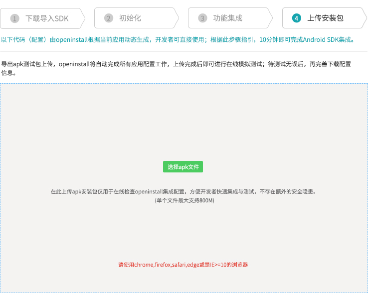

# openinstall-hbuilder-sdk

uni-app集成openinstall请前往DCloud插件市场 https://ext.dcloud.net.cn/plugin?id=692 

## Android 集成指南

集成 openinstall SDK 到 Hbuilder Android 项目中，请参考 [Android 集成指南](README/Android.md)

## iOS 集成指南

集成 openinstall SDK 到 Hbuilder iOS 项目中，请参考 [iOS 集成指南](README/iOS.md)

## 插件使用

#### 1 快速下载
如果只需要快速下载功能，无需其它功能（携带参数安装、渠道统计、一键拉起），完成初始化即可（包括iOS.md和Android.md中的初始化工作）  


#### 以下功能需引入 JS 文件
``` html
<script type="text/javascript" src="./js/openinstall.js"></script>
```

#### 2 一键拉起
##### 一键拉起的配置见iOS.md和Android.md相关文档
##### 获取拉起数据
在应用启动时，注册拉起回调。这样当 App 被拉起时，会回调传入的方法，并在回调中获取拉起数据
``` js
document.addEventListener('plusready',function(){
    plus.openinstall.registerWakeUpHandler(function(data){
                console.log("wakeup : channelCode= "
                    + data.channelCode + ", bindData=" + data.bindData);
                alert("wakeup : channelCode= " + data.channelCode + ", bindData=" + data.bindData);
            });

},false);
```

#### 3 携带参数安装（高级版功能）
##### 获取安装参数  
在应用需要安装参数时，调用以下 api 获取由 SDK 保存的安装参数
``` js
function getInstall(){
    plus.openinstall.getInstall(function(data){
        console.log("getInstall : channelCode= "
                + data.channelCode + ", bindData=" + data.bindData);
    }, 8);
}
```

#### 4 渠道统计（高级版功能）
##### SDK 会自动完成访问量、点击量、安装量、活跃量、留存率等统计工作。其它业务相关统计由开发人员使用 api 上报

##### 4.1 注册统计
请确保在用户注册成功后，调用接口上报注册量
``` js
function reportRegister(){
    plus.openinstall.reportRegister();
}
```

##### 4.2 效果点统计
统计终端用户对某些特殊业务的使用效果，如充值金额，分享次数等等。调用接口前，请先进入 openinstall 管理后台 “效果点管理” 中添加效果点，第一个参数对应管理后台 *效果点ID*
``` js
function reportEffectPoint(){
    plus.openinstall.reportEffectPoint("effect_test", 1);
}
```

## 导出apk/api包并上传
- 代码集成完毕后，需要导出安装包上传openinstall后台，openinstall会自动完成所有的应用配置工作。  
- 上传完成后即可开始在线模拟测试，体验完整的App安装/拉起流程；待测试无误后，再完善下载配置信息。  

下面是apk包的上传界面（后台截图）：  


