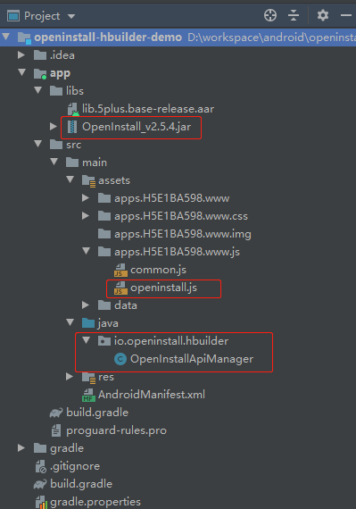
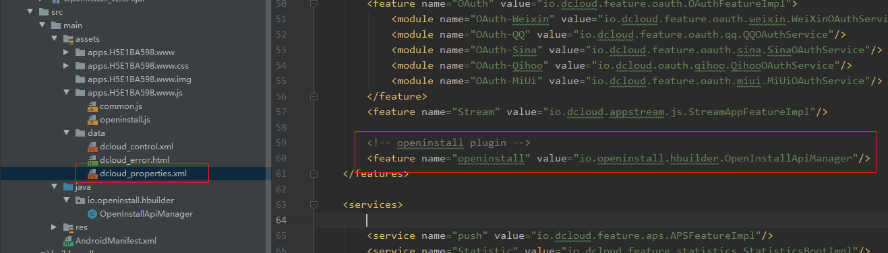
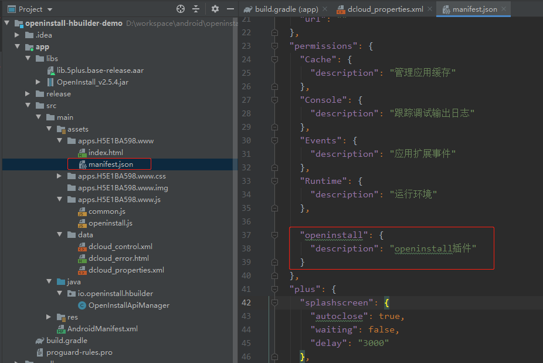
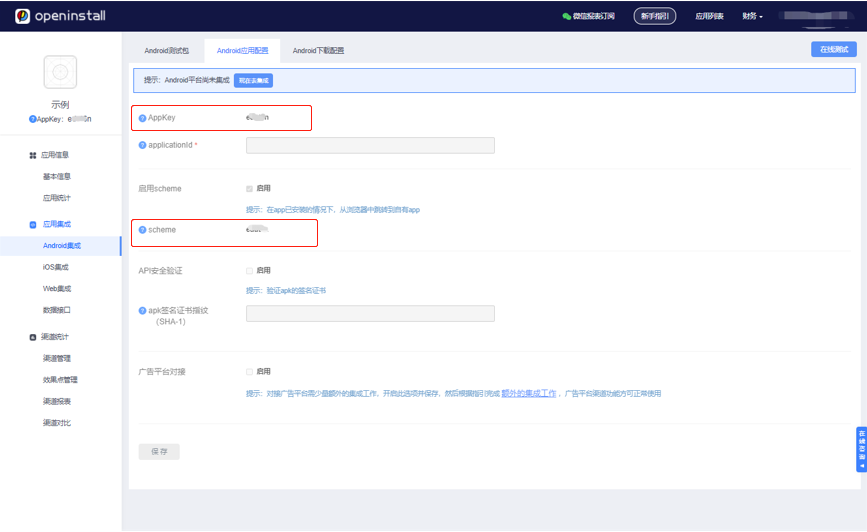

## Android 集成指南

#### 离线打包
如果要集成使用非基座包下的第三方 SDK，就必须使用离线打包。可以参考 [官方文档](http://ask.dcloud.net.cn/article/508) 进行离线打包，如果觉得官方文档太难理解，可以查看其他技术人员的教程，例如 [DCloud技术与androidstudio打包](https://blog.csdn.net/qq_33785670/article/details/75042714) 

#### 拷贝相关文件
- 将 `Android/libs` 文件夹下的 openinstall SDK 拷贝到项目的 `app/libs` 文件夹下 
- 将 `Android/java` 目录下的文件夹拷贝到项目的 `app/src/main/java` 目录下
- 将 `js` 目录下的 `openinstall.js` 拷贝到项目工程 `app/src/main/assets/` 目录中的 `www` 资源的 js 文件目录下  

> **注意：** 请开发者在进行升级时，重新拷贝并覆盖旧的文件，删除低版本SDK

拷贝完所有文件后，最终的项目结构如下图 


#### 关联 JS 插件名和 Android 原生类
修改项目的 `app/src/main/assets/data/` 目录下的 `dcloud_properties.xml`文件，指定 JS 对象名称和 Android 的类名对应关系，以便 H5+ SDK 根据对应的 JS 名查找并生成相应的 Native 对象执行对应的逻辑
``` xml
<properties>
    <features>
        <!-- more feature -->

        <!-- openinstall plugin -->
        <feature name="openinstall" value="io.openinstall.hbuilder.OpenInstallApiManager"/>
    </features>
</properties>
```

#### 添加插件使用权限
修改 `app/src/main/assets/`目录中的 `www` 目录下的 `manifest.json`文件，添加扩展插件openinstall的应用使用权限
``` json
{
  "@platforms": [
    "android",
    "iPhone",
    "iPad"
  ],
  "id": "H5E1BA598",
  "name": "OpenInstallPlugin",
  
  "permissions": {
    "Console": {
      "description": "跟踪调试输出日志"
    },
    "Events": {
      "description": "应用扩展事件"
    },
    
    
    "openinstall": {
      "description": "openinstall插件"
    }
  },
  
}
```


#### 声明权限
在 `AndroidManifest.xml` 中添加基本的权限声明
``` xml
<uses-permission android:name="android.permission.ACCESS_NETWORK_STATE"/>
<uses-permission android:name="android.permission.INTERNET"/>
```
#### 配置 AppKey 和 scheme 
前往 [openinstall控制台](https://www.openinstall.io/) ，进入应用，选择
“Android集成”，切换到“Android应用配置”，获取应用的 `AppKey` 和 `scheme`。


在 `AndroidManifest.xml` 中配置 AppKey 和 scheme，示例如下：   
``` xml
<application
    android:allowBackup="false"
    android:allowClearUserData="true"
    android:icon="@drawable/icon"
    android:label="@string/app_name"
    android:largeHeap="true"
    android:supportsRtl="true">
    <!-- openinstall appkey 配置 -->
    <meta-data
        android:name="com.openinstall.APP_KEY"
        android:value="openinstall为应用分配的appkey"/>

    <activity
        android:name="io.dcloud.PandoraEntry"
        android:configChanges="orientation|keyboardHidden|screenSize|mcc|mnc|fontScale"
        android:hardwareAccelerated="true"
        android:screenOrientation="user"
        android:theme="@style/TranslucentTheme"
        android:launchMode="singleTask"
        android:windowSoftInputMode="adjustResize">
        <intent-filter>
            <action android:name="android.intent.action.MAIN"/>

            <category android:name="android.intent.category.LAUNCHER"/>
        </intent-filter>
        <!-- opeinstall scheme 配置 -->
        <intent-filter>
            <action android:name="android.intent.action.VIEW"/>

            <category android:name="android.intent.category.DEFAULT"/>
            <category android:name="android.intent.category.BROWSABLE"/>

            <data android:scheme="openinstall为应用分配的scheme"/>
        </intent-filter>
    </activity>
</application>
```
> 注意：将openinstall控制台获取的`AppKey` 和 `scheme`替换到相应位置 。


